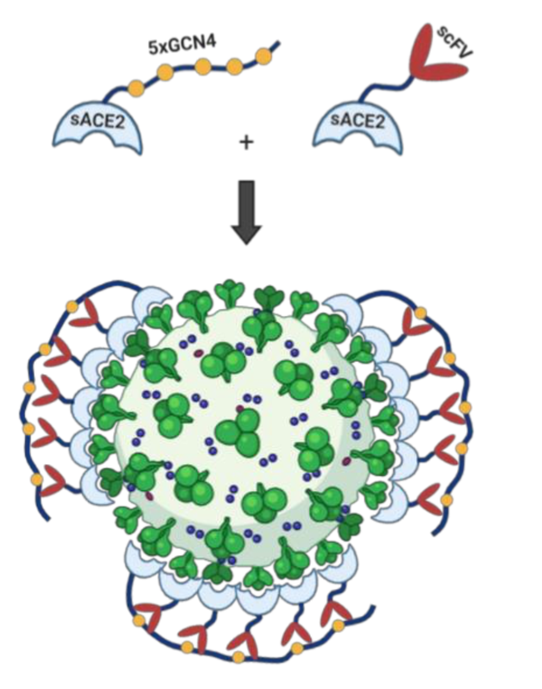
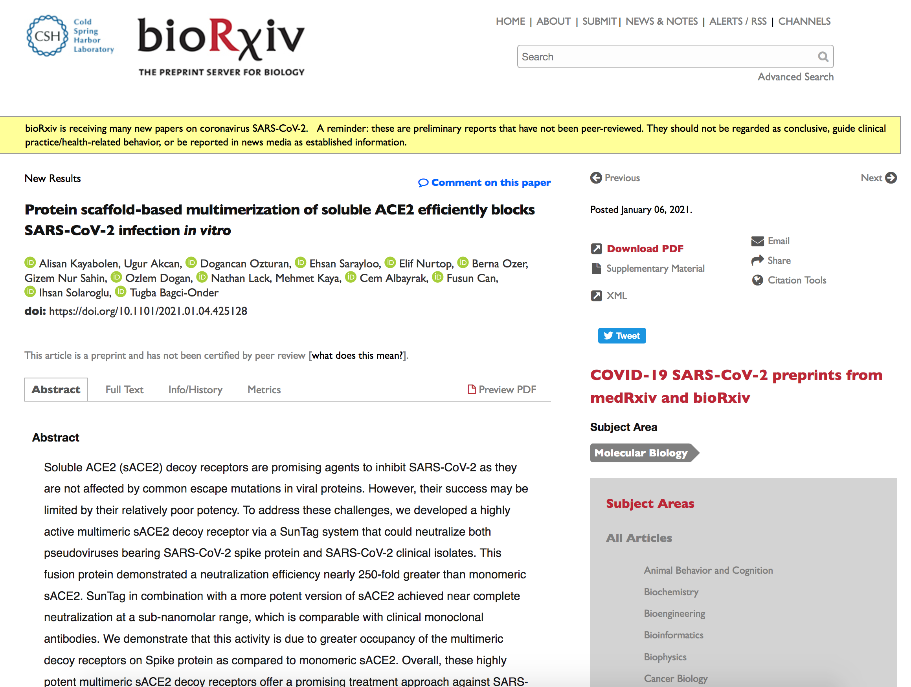
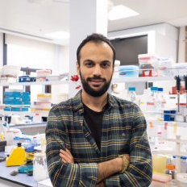
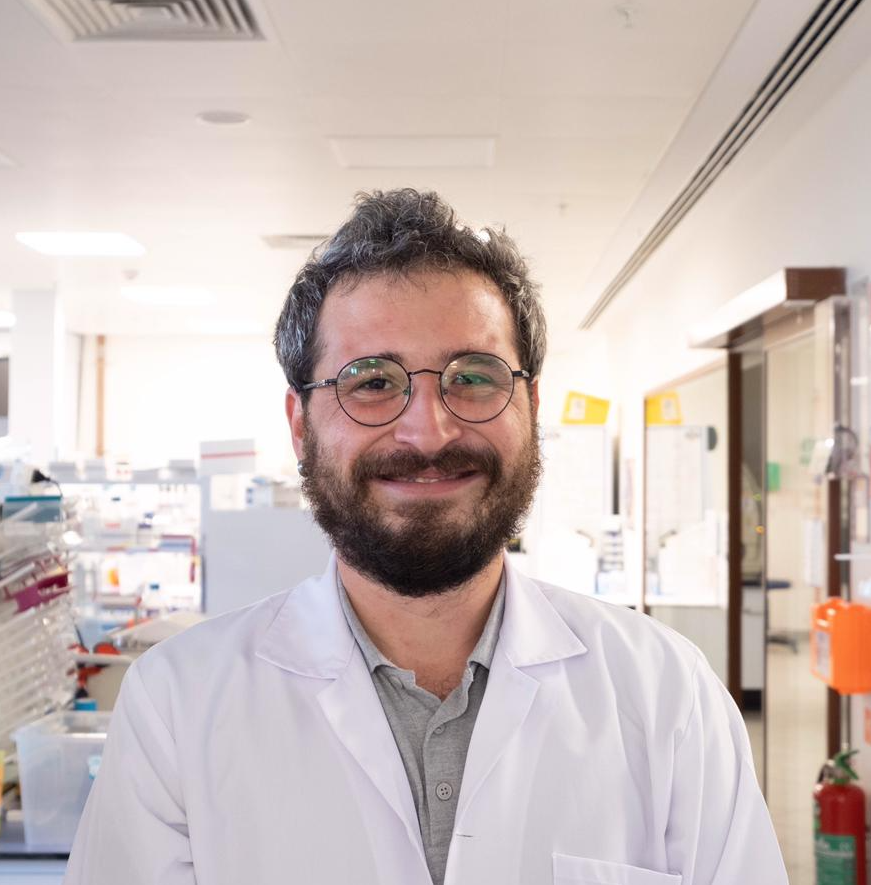

<link href="https://cdn.jsdelivr.net/npm/bootstrap@5.0.0-beta2/dist/css/bootstrap.min.css" rel="stylesheet" integrity="sha384-BmbxuPwQa2lc/FVzBcNJ7UAyJxM6wuqIj61tLrc4wSX0szH/Ev+nYRRuWlolflfl" crossorigin="anonymous">

 

      

          

            
We are going to design and produce stable, active and targeted receptor-based drugs to combat various infectious diseases such as COVID-19.

Viruses use receptor proteins to enter host cells. Solubilized decoy receptors have already  been used to bind viruses extracellularly to block cell entry. However, as viruses have many surface proteins, these monomeric decoy receptors need to be used in high concentrations. Our idea is to use a sophisticated multimerization system called “SunTag” to create a chain of decoy receptors. We aim to cover the whole surface of the virus with these particles and block the cell entry much more efficiently.

We want to expand our preliminary results on the SARS-CoV-2 to other viruses and diseases. Simply, after identifying the receptors that disease-causing viruses use for cell entry, our aim is to prepare a SunTag-fused receptor library. Then, we will characterize all the library elements in terms of their viral neutralization efficiency. Finally, we will determine potential drugs to be used in clinical trials for these diseases. 

          

          

            
          

        

      
  
      
  
        
### Check out our BioRxiv preprint

      

          

            
[https://www.biorxiv.org/content/10.1101/2021.01.04.425128v1.abstract](https://www.biorxiv.org/content/10.1101/2021.01.04.425128v1.abstract)

          

          

            
          

        

      

      

### Inventors
 

        

          

            
            <h2>Alisan Kayabolen, PhD</h2>
            
Post-doctoral Fellow in Molecular Biology

            <a class="btn btn-social-icon btn-twitter">
    
  </a>
          
<!-- /.col-lg-4 -->
          

            
            <h2>Ugur Akcan</h2>
            
PhD Candidate in Neuroscience

          
<!-- /.col-lg-4 -->   
          

            
            <h2>Dogancan Ozturan</h2>
            
PhD Candidate in Biomedical Sciences
     
          
<!-- /.col-lg-4 -->
        

      

